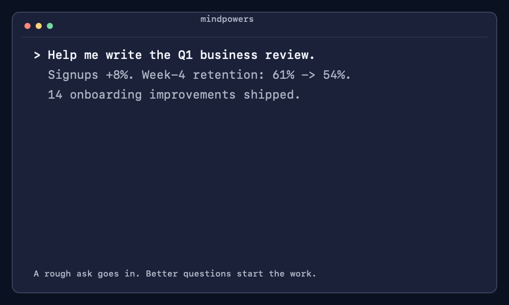

# Mindpowers

**Claude Code and Claude Cowork plugin: brainstorming superpowers for knowledge workers.**



Mindpowers gives Claude a careful way to handle documents that aren't code: memos, reviews, PRDs, decisions, comms. Instead of jumping straight to a draft, Claude asks you questions until the rough idea becomes a clear, written spec, then carries that spec through drafting and review, and remembers what worked so the next one starts smarter.

It's the knowledge-work version of [obra/superpowers](https://github.com/obra/superpowers), and a cousin of [coworkpowers](https://github.com/nabeelhyatt/coworkpowers).

## The loop

mindpowers does one loop: shape, draft, review, and remembers what you like.

| Skill | What it does |
|---|---|
| `mindstorming` | Turns a rough idea into a locked spec through Socratic dialogue (verbal approval, then written approval) |
| `drafting` | Turns a locked spec into the actual deliverable, holding it to the template's standards |
| `reviewing-docs` | Red-teams any doc, drafted here or pasted in, against its spec and template before it ships |
| `calibrating` | Records what landed and what got rewritten, so the next mindstorming session starts calibrated |

## Before / after

A cold-drafted business review usually opens like this:

> This quarter we shipped 14 features across three teams. Signups were up 8% month over month, and support tickets held roughly steady. The team continued to invest in onboarding improvements throughout the quarter.

A mindstorming-spec'd version front-loads the thing that matters:

> Growth is masking a retention problem: signups are up 8%, but week-4 retention slipped from 61% to 54%, the first drop in a year. Onboarding shipped 14 features this quarter; none of them targeted the drop.

- Same underlying facts, different order: insight and the lowlight lead, not buried three paragraphs in.
- The spec forces this before drafting starts: "insight before data" is the template's standard, decided at spec time, not fixed in editing later.

(Illustrative excerpt, not a real review.)

## Templates

Nine templates, plus a fallback for anything that doesn't fit one:

| Template | When it fires |
|---|---|
| [`business-review`](skills/mindstorming/references/business-review.md) | Weekly or quarterly product reviews |
| [`decision-doc`](skills/mindstorming/references/decision-doc.md) | Strategic arguments, OKR defence, build-vs-buy |
| [`one-pager`](skills/mindstorming/references/one-pager.md) | Pre-solution pitch for buy-in, before a PRD or a formal decision doc. Sometimes labeled BRD |
| [`prd`](skills/mindstorming/references/prd.md) | Product specs |
| [`briefing-doc`](skills/mindstorming/references/briefing-doc.md) | Partner meetings, exec syncs, regulator prep |
| [`comms-draft`](skills/mindstorming/references/comms-draft.md) | Slack messages, team emails, announcements |
| [`framework`](skills/mindstorming/references/framework.md) | Methods, rubrics, playbooks |
| [`talking-points`](skills/mindstorming/references/talking-points.md) | OKR defence, Q&A prep, anything you'll say out loud |
| [`post-mortem`](skills/mindstorming/references/post-mortem.md) | Incident or project retros: what happened, root cause, what changes |
| `self-shape` | Anything else, Claude asks one question at a time |

Each template carries the lessons that make that kind of document good: lead with the insight (not the data) in a business review, put the recommendation first in a decision doc, write hypotheses you can actually prove or disprove in a PRD.

## How it works

Mindstorming, the "shape" step, runs a 10-step process:

1. Read context: recent specs in `docs/mindpowers/specs/` and `docs/mindpowers/preferences.md`, so it knows what you've done before and what you like
2. Pick the matching template, or `self-shape` if nothing fits. Decide whether the topic is routine or new ground for you
3. Offer a visual companion if the conversation looks like it needs sketches or diagrams
4. Ask questions: batched when the task is routine and a template fits, one at a time otherwise
5. Propose two or three approaches when the path isn't obvious
6. Walk through the plan and get your spoken approval. If you say the structure feels too generic, Claude researches the topic before trying again
7. Write the spec to `docs/mindpowers/specs/YYYY-MM-DD-<type>-<slug>.md`
8. Check its own work and show you what it checked
9. You read the written spec and give final approval, which flips its status to `locked`
10. Hand off in a way that fits the document: "draft it, hand back, or stop?" for brief-style docs; "stop, draft something, or pause?" when the spec itself is the deliverable

From there, `drafting` turns the locked spec into the document, `reviewing-docs` pressure-tests it on request (yours or something someone else wrote), and `calibrating` banks what you learned for next time.

## Install

### Claude Code

```bash
claude plugin marketplace add rohitgehe05/mindpowers && claude plugin install mindpowers@mindpowers
# Skill namespace: /mindpowers:mindstorming
```

### Cowork (Claude Desktop)

1. Download the `mindpowers-cowork-v*.zip` from the [latest release](https://github.com/rohitgehe05/mindpowers/releases/latest)
2. In Cowork: **Customize → Personal plugins → `+`**
3. Click "Upload local plugin", drag/select the zip, click **Upload**
4. Plugin appears in sidebar under Personal plugins. Trigger by asking for a brainstorm (e.g. "draft a PRD for X")

## Works alongside superpowers

`superpowers:brainstorming` fires for code and features. `mindpowers:mindstorming` fires for documents and comms. Writing a PRD belongs to mindpowers; building what the PRD describes belongs to superpowers. And where coworkpowers is a suite, mindpowers is the one loop that stops Claude from writing the wrong doc in the first place.

## Where files go

```
docs/mindpowers/specs/          locked intent, one file per document
docs/mindpowers/drafts/         the actual deliverables, same stem as their spec
docs/mindpowers/reviews/        red-team notes
docs/mindpowers/preferences.md  what you've liked, by template type
```

Specs often carry sensitive content (leadership comms, OKR politics, exec briefings): in a shared or public git repo, mindstorming warns you and suggests `.gitignore`-ing `docs/mindpowers/` or picking a private location.

## What's new

- **0.6**: `one-pager` joins the templates, for pitching a direction and getting fast alignment before a full PRD or decision doc gets written. BRD is the same template at more weight, not a separate one.
- **0.5**: `calibrating` remembers what landed and what you changed, per template type, in `docs/mindpowers/preferences.md`. Mindstorming reads it at the start of every session, so your fourth business review starts smarter than your first.
- **0.4**: `drafting` and `reviewing-docs` complete the loop, and `post-mortem` joins the templates.

Full history in the [CHANGELOG](CHANGELOG.md).

## Philosophy

- **Two approvals beat one.** Talking it through misses things. Writing it down catches them.
- **Templates hold the lessons.** Standards you learned the hard way belong in a template, not your memory.
- **Cut ruthlessly.** Every section in a spec has to earn its place.
- **When nothing fits, slow down.** No template means one question at a time, which forces you to actually think.
- **No task is too small.** The spec for a Slack reply is short, but it still exists, except for short comms, which stay in chat unless you want a record.

## Credits

Built on:

- [obra/superpowers](https://github.com/obra/superpowers): the original skills framework and the brainstorming idea
- [nabeelhyatt/coworkpowers](https://github.com/nabeelhyatt/coworkpowers): the knowledge-work version that shaped the template approach

## License

MIT
